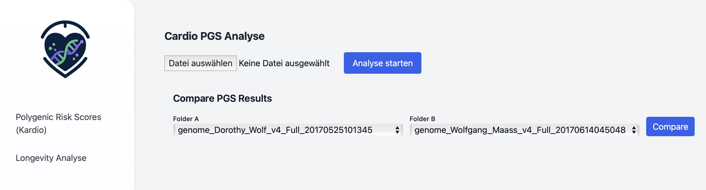
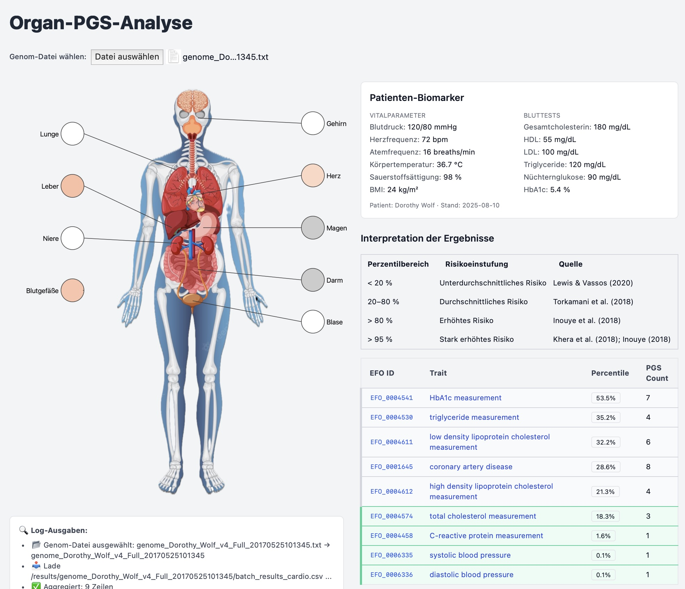

# Longevity – Epigenetische und Polygenische Risiko-Berechnung & Analyse

Dieses Projekt besteht aus **zwei Hauptkomponenten**:

1. **Teil 1 – Berechnung der Polygenic Risk Scores (PRS)**  
   Lädt eine **23andMe-Rohdaten-Datei**, extrahiert relevante SNPs und berechnet **Polygenic Risk Scores (PRS)** für definierte EFO-Traits.

2. **Teil 2 – Analyse- und Visualisierungs-App**  
   Nutzt die in Teil 1 berechneten PRS-Daten, verknüpft sie mit wissenschaftlichen Referenzen, SNP-Details und optionalen Patienten-Biomarkern und stellt sie visuell dar.

Die Kombination beider Teile ermöglicht eine vollständige **End-to-End-Pipeline** – von der Rohdatenanalyse bis zur interaktiven Risikodarstellung.

### Schnellstart

```bash
# Dependencies installieren
npm install

# Dev-Server starten
npm run dev
# -> http://localhost:3000 

# PRS-Berechnung starten
# -> http://localhost:3000/personal_pgs

# Longevity und PRS-Analyse starten
# -> http://localhost:3000/patient_view
```
---

## Teil 1 – Berechnung Polygenic Risk Scores (PRS)

Dieser Teil der Anwendung lädt eine **23andMe-Rohdaten-Datei** (`.txt`), extrahiert relevante SNPs und berechnet **Polygenic Risk Scores (PRS)** für ausgewählte **EFO-Traits**.  
Die Berechnung läuft im **Web Worker** (`/workers/prs.worker.js`), sodass die UI responsiv bleibt. Ergebnisse werden als **CSV** (aggregiert & Details) sowie als **JSON pro EFO** gespeichert.



### Features

- Upload einer 23andMe-Rohdaten-Datei (`.txt`)
- PRS-Berechnung im Browser (Web Worker)
- Fortschrittsanzeige (aktuelles PGS & %)
- Live-Log im UI (Debug/Status)
- Speicherung der Ergebnisse:
  - `batch_results_cardio.csv` (aggregiert)
  - `batch_details_cardio.csv` (Details je PGS/EFO)
  - `efoDetailsMap` → JSON pro EFO über `/api/saveEfoDetail`
- Vergleichskomponente `ComparePGSDiffs` (optional)

### Ziel-Traits (EFO) & zugehörige PGS

Die Berechnung ist aktuell auf kardiometabolische Traits fokussiert:

- **EFO_0004541** – HbA1c measurement → `PGS000127, PGS000128, PGS000129, PGS000130, PGS000131, PGS000132, PGS000304`
- **EFO_0004611** – LDL cholesterol → `PGS000061, PGS000065, PGS000115, PGS000310, PGS000340, PGS000661`
- **EFO_0004612** – HDL cholesterol → `PGS000060, PGS000064, PGS000309, PGS000660`
- **EFO_0004530** – Triglycerides → `PGS000063, PGS000066, PGS000312, PGS000659`
- **EFO_0001645** – Coronary artery disease → `PGS000010, PGS000011, PGS000012, PGS000019, PGS000057, PGS000058, PGS000059, PGS000116, PGS000200, PGS000337, PGS000349`
- **EFO_0006335** – Systolic blood pressure → `PGS000301, PGS002009`
- **EFO_0004574** – Total cholesterol → `PGS000062, PGS000311, PGS000658, PGS000677`
- **EFO_0004458** – C-reactive protein → `PGS000314, PGS000675`
- **EFO_0006336** – Diastolic blood pressure → `PGS000302, PGS001900`

> Die EFO→PGS-Zuordnung ist in der Komponente hart codiert und kann leicht erweitert werden.

---

## Teil 2 – Analyse-App für kardiovaskuläre PRS-Ergebnisse

Dieser Teil der Anwendung stellt die im ersten Schritt berechneten Polygenic Risk Scores (PRS) visuell dar und verknüpft sie mit EFO-Traits, SNP-Informationen sowie optionalen Patienten-Biomarkern.
Die App ermöglicht eine organbasierte Visualisierung, Detailansichten zu einzelnen EFOs und die Interpretation von Risikoperzentilen basierend auf wissenschaftlicher Literatur.

### Features
- **Datenimport** der im PRS-Teil erzeugten CSV-Dateien:
  - `batch_results_cardio.csv` – aggregierte PRS-Daten pro EFO
  - `batch_details_cardio.csv` – Details zu einzelnen PGS/EFO-Kombinationen
- Organ-Map (SVG/D3): Farbige Hervorhebung von Organen entsprechend dem durchschnittlichen PRS-Perzentil
- Interaktive Tooltips und Klick-Navigation zu EFO-Detailseiten
- Balkendiagramm (`chart.js`) für log10(Avg PRS) pro Trait
- Patienten-Biomarker-Panel (Vitalparameter & Bluttests aus `biomarkers.json`)
- Risikoklassifikation basierend auf Perzentilbereichen:
  - < 20 %: Unterdurchschnittlich
  - 20–80 %: Durchschnittlich
  - 80–95 %: Erhöht
  - 95 %: Stark erhöht
- Log-Bereich für Lade- und Verarbeitungsstatus
- Integration von Referenzstatistiken (`reference_stats.json`) für z-Score- und Perzentil-Berechnungen



### Trait-PGS Detailansicht

Die Komponente rendert eine Detailseite für einen **EFO-Trait** (z. B. *coronary artery disease*) und stellt die folgenden Informationen dar: eine Zusammenfassung aller geladenen PGS-Modelle (Median/Min/Max Perzentil, PRS-Spanne), das **Anker-PGS** (das Modell mit dem höchsten Perzentil oder dem größten |PRS|), ein **Top-Varianten-Chart** für das Anker-PGS, eine Tabelle aller PGS-Modelle mit Perzentil-Einstufungen und Links zu **dbSNP/Publikationen**, ein **Patienten-Biomarker-Panel** (Vitalparameter, Blutwerte) sowie EFO-bezogene Biomarker mit Hinweisen, die über eine Ampel-Logik gesteuert werden.

-----

### Dateistruktur (erwartet)

Die Anwendung erwartet, dass die folgenden Dateien im `public`-Verzeichnis abgelegt sind.

```bash
/public
  /biomarker_efo_mapping.json
  /biomarker_thresholds.json
  /results
    /<GENOME_NAME>/
      biomarkers.json
      /details/
        <EFO_ID>.json
```

**Hinweis:** Die Komponente wird typischerweise unter `/pages/longevity/details/[efoId].js` eingebunden.

-----

### Abhängigkeiten

```bash
npm i next react react-dom
npm i chart.js react-chartjs-2
```

Die Komponente nutzt die **Pages Router API** von Next.js und **Chart.js**.

-----

### Routing & Aufruf

Ein Beispiel-Link zur Detailansicht sieht wie folgt aus: `<a href="/longevity/details/${efoId}?genome=${encodeURIComponent(genomeName)}">Details ansehen</a>`. Die Seite wird unter `/longevity/details/[efoId]` gerendert. **Pflichtparameter**: `?genome=<GENOME_NAME>` (z. B. `genome_Dorothy_Wolf_v4_Full_20170525101345`).

-----

### Erwartete Datenformate

**1) `/results/<GENOME_NAME>/details/<EFO_ID>.json`**

Diese Datei akzeptiert entweder ein Array von Modellen oder ein Objekt `{ "detail": [ ... ] }`. Jedes Modell sollte die folgenden Felder enthalten:

```json
[
  {
    "id": "PGS000123", "trait": "Coronary artery disease", "prs": 0.81234, "rawScore": 0.81234, "zScore": 2.15, "percentile": 96.3, "matches": 503421, "totalVariants": 1200000,
    "topVariants": [
      {
        "variant": "chr1:12345_A_G; rs12345", "rsid": "rs12345", "score": 0.0123
      }
    ]
  }
]
```

**2) `/results/<GENOME_NAME>/biomarkers.json`**

Diese Datei enthält die Biomarker-Daten des Patienten:

```json
{
  "name": "Patientenname (optional)", "dateRecorded": "YYYY-MM-DD",
  "biomarkers": {
    "vitals": {
      "bloodPressure": { "systolic": 118, "diastolic": 74, "unit": "mmHg" }
    },
    "bloodTests": {
      "totalCholesterol": { "value": 180, "unit": "mg/dL" }, "hba1c": { "value": 5.4, "unit": "%" }
    }
  }
}
```

**3) `/biomarker_efo_mapping.json`**

Diese Datei stellt ein Mapping bereit, welche Biomarker für einen bestimmten EFO-Trait relevant sind:

```json
{
  "bloodPressureSystolic": ["EFO_0001645", "EFO_0000537"], "ldlCholesterol": ["EFO_0001645"]
}
```

**4) `/biomarker_thresholds.json`**

Diese Datei definiert die Schwellenwerte für die Ampel-Logik:

```json
{
  "bloodPressureSystolic": [
    { "max": 119, "tone": "green", "note": "Optimal" },
    { "max": 129, "tone": "yellow", "note": "Erhöht" },
    { "max": null, "tone": "red", "note": "Hypertonie" }
  ],
  "hba1c": [
    { "max": 5.6, "tone": "green", "note": "Normal" },
    { "max": 6.4, "tone": "yellow", "note": "Prädiabetes" },
    { "max": null, "tone": "red", "note": "Diabetesbereich" }
  ]
}
```

-----

### UI-Logik (Kernelemente)

  * **Perzentil-Badges**: `<20%` = Unterdurchschnittlich, `20-80%` = Durchschnittlich, `80-95%` = Erhöht, `>95%` = Stark erhöht.
  * **Anker-PGS**: Das Anker-PGS ist primär das Modell mit dem höchsten Perzentil. Gibt es keine Perzentile, wird das Modell mit dem größten |PRS| als Fallback gewählt.
  * **SNP-Zusammenfassungen**: Die Top-10-rsIDs des Anker-PGS werden vorab geladen. Zusätzliche rsIDs können **On-Demand** über einen Button abgerufen werden. Die Daten werden in einem separaten Summary-Panel angezeigt.

-----

### API-Endpoint (erwartet)

Die Komponente erwartet einen Endpoint unter `/api/snp-summary?rsid=<RSID>`, der eine JSON-Antwort im folgenden Format liefert:

```json
{
  "text": "Kurz- bzw. Langzusammenfassung zur Variante...",
  "url": "https://doi.org/...",
  "logs": ["[timestamp] ..."]
}
```

Im Fehlerfall sollte der `text` eine Fehlermeldung enthalten und `url` `null` sein.

-----

### Quickstart

1.  **Abhängigkeiten installieren**: `npm i next react react-dom` und `npm i chart.js react-chartjs-2`.
2.  **Dateistruktur anlegen**: Erstelle die erforderlichen Verzeichnisse und JSON-Dateien im `public`-Ordner.
3.  **Dev-Server starten**: `npm run dev`.
4.  **Seite aufrufen**: Öffne deinen Browser und navigiere zu `http://localhost:3000/longevity/details/EFO_XXXXXXX?genome=<GENOME_NAME>`.

---

### Longevity Sicht

Diese Client-Seite visualisiert einen **Longevity-Index** und ein **biologisches Alter** aus  
- genetischen PGS-Signalen (EFO-basierte z-Scores/Perzentile) und  
- klinischen Biomarkern/Vitalparametern (z. B. Blutdruck, Lipide, Nüchternglukose, HbA1c, BMI).

Die Datei ist eine **Next.js Client Component** (mit `'use client'`) und erwartet Ergebnisse im Verzeichnis `/public/results/<GENOME_NAME>/`.

## Features
- Longevity-Index (0–100) mit Balkenanzeige
- Aufteilung in **Genetik** und **Biomarker**
- Biologisches vs. chronologisches Alter inkl. **Vascular Aging Plot** (SVG)
- Genomische PRS-Korrektur in **Jahren** samt Komponentenaufschlüsselung
- Heuristische „Top-Hebel“ aus Biomarkern

---

## Voraussetzungen
- **Next.js** (Pages Router; Import `useRouter` aus `next/router`)
- **React 18**
- **Tailwind CSS** (für Stylingklassen)
- **PapaParse** (CSV-Parsing)
- Layout-Komponente: `components/DashboardLayout` (lokal vorhanden)

**Installation (Basis):**
```bash
npm install next react react-dom papaparse
# Tailwind nur falls noch nicht eingerichtet:
# https://tailwindcss.com/docs/guides/nextjs
```
```
/public
/longevity_pgs.json
/results
  /genome_Dorothy_Wolf_v4_Full_20170525101345
    /batch_details_cardio.csv
    /biomarkers.json
  /components
/DashboardLayout.jsx

/pages
  /longevity
    /[genome].js # <-- diese Datei
```

## Eingabedaten

### 1) `/public/longevity_pgs.json`
Konfiguration der PGS-Komponenten (welche EFOs, Gewichte, Richtung).

**Schema (Beispiel):**
```json
[
  { "label": "Coronary artery disease", "efo": "EFO_0001645", "weight": 1.5, "direction": "higher-worse" },
  { "label": "Systolic BP",             "efo": "EFO_0006335", "weight": 1.2, "direction": "higher-worse" },
  { "label": "HDL",                     "efo": "EFO_0004612", "weight": 0.4, "direction": "higher-better" }
]
```

### Beispiel `biomarkers.json`

```json
{
  "person": {
    "gender": "male",
    "dateOfBirth": "1965-07-10"
  },
  "biomarkers": {
    "dateRecorded": "2025-07-20",
    "vitals": {
      "bloodPressure": {
        "systolic": 118,
        "diastolic": 74,
        "unit": "mmHg"
      }
    },
    "bloodTests": {
      "hdlCholesterol": {
        "value": 52,
        "unit": "mg/dL"
      },
      "ldlCholesterol": {
        "value": 95,
        "unit": "mg/dL"
      },
      "triglycerides": 110,
      "fastingGlucose": {
        "value": 92,
        "unit": "mg/dL"
      },
      "hba1c": {
        "value": 5.5,
        "unit": "%"
      }
    },
    "other": {
      "bmi": {
        "value": 24.1,
        "unit": "kg/m²"
      }
    }
  }
}
```

### Voraussetzungen
- Die Analyse-App benötigt Ausgabedateien aus Teil 1 im Verzeichnis:
`/results/<genomeName>/`
  - `batch_results_cardio.csv`
  - `batch_details_cardio.csv`
  - optional: `biomarkers.json`
- Statische Mapping-Dateien im public/-Verzeichnis:
  - `efo_to_organ.json` – Zuordnung von EFO-Traits zu Organen
  - `traits.json` – EFO-ID zu Traitnamen
  - optional: `reference_stats.json` – statistische Referenzwerte für PGS

### Voraussetzungen

- Node.js (empfohlen: v20+)
- Next.js-App (dieses Repo)
- Browser mit Web-Worker-Support
- 23andMe-Rohdaten-Datei (`.txt` mit Spalten: `rsid, chromosome, position, genotype`)


